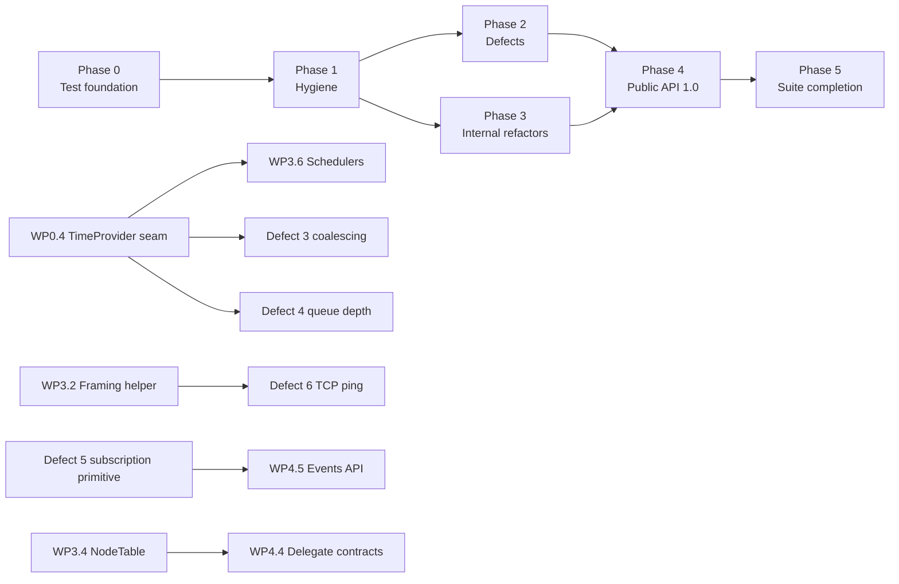

# NSerf remediation plan

This plan turns the findings in `code-review-required-changes.md` into ordered, test-first work. It assumes what the project already assumes: tests are the backbone, so every change below is specified as the test that fails first, the change that makes it pass, and the Go behaviour that decides what "correct" means. Nothing in the review is dropped; section 9 maps every review item to a work package.

The order is deliberate. The test infrastructure is repaired first, because a 13-minute serial suite with 313 sleeps cannot support the tight red-green loop that the later refactors need. Defects come next because they change behaviour and must ship with tests that pin the Go semantics. Behaviour-preserving refactors follow under those tests. The breaking public API release comes last, when the internals it exposes are already in their final shape.

---

## 0. Working agreement

- **Red before green.** Every behavioural change starts with a failing test that names the Go behaviour it restores. The test is committed first (`test:` prefix), the change second (`fix:` or `refactor:`), so the history shows the red and the green.
- **Characterise before refactoring.** A change with no intended behaviour change first pins the current behaviour of the code it touches with characterisation tests, then refactors, and the tests stay. If a characterisation test reveals a divergence from Go, that becomes a defect item with its own red test, never a silent fix inside the refactor.
- **Green at every commit on `dev`.** No `Skip`, no commented-out test, no widened timeout to get past a failure. A test that must change because behaviour changes deliberately is changed in the same commit, and the commit message cites the Go function that justifies it.
- **Tests die only with their subject.** A test is deleted only when the code it tests is deleted (dead code), and the pull request lists every deleted test by name.
- **Go is the oracle.** For any behaviour question, find the test in the Go repositories (`memberlist/*_test.go`, `serf/serf/*_test.go`, `serf/cmd/serf/command/**/*_test.go`), port it if NSerf lacks it, and name the port after the Go test.
- **Wire compatibility is proven, not assumed.** The golden msgpack fixtures and the Go interop collection (WP0.6) must pass before and after any change to encoding, framing, security or the state handlers.
- **Unit tests never touch sockets, files or the wall clock.** They use `MockNetwork`/`MockTransport`, in-memory streams, `FakeTimeProvider` and temp directories that the fixture removes. They run in parallel.
- **Integration tests own their ports and their time.** Every one has a `Timeout`, allocates ports from the OS, waits on conditions rather than sleeping, and belongs to a collection that says what it shares.
- **One work package per pull request**, with the checklist in section 8 completed.

---

## 1. Phase 0: test foundation

**Goal:** a unit suite that runs in under a minute in parallel, an integration suite that runs in under eight minutes, deterministic time, and an interop check against real Go Serf. Nothing in the library changes behaviour in this phase; the only production change is the injection seam for time.

- **WP0.1 Categorise before splitting.** Add `[Trait("Category", "Unit")]` / `"Integration"` to every existing test class (a class is Unit only if it uses no sockets, no `Task.Delay`, no file system). Add `.runsettings` filters and make the CI pull-request job run Unit only, with the full suite on merge and nightly. Test: a unit test that scans the unit category for `Task.Delay(` and real-port helpers and fails on any hit, so the category cannot decay.
- **WP0.2 Split the projects.** Create `NSerf.UnitTests` (parallel, `MockNetwork`, fakes) and `NSerf.IntegrationTests` (loopback, collections per shared resource); move classes by category, keeping file history with `git mv`. Keep `NSerf.CLI.Tests` as is. The old `NSerfTests` project disappears only when it is empty.
- **WP0.3 Cluster fixture.** `TestCluster : IAsyncLifetime` creates N Serf nodes (port 0, unique names, optional encryption, optional snapshot directory), exposes `WaitForMembersAsync(count, state, timeout)`, `WaitForEventAsync(predicate, timeout)`, `PartitionAsync(a, b)` for the mock network, and disposes everything even when a test fails. Tests for the fixture itself: nodes converge, disposal releases every port, failures surface the node logs. Every new cluster test uses it; existing tests migrate when they are touched.
- **WP0.4 Time seam.** Add `TimeProvider` to `Config`, `MemberlistConfig` and `AgentConfig` (default `TimeProvider.System`) and thread it to query deadlines, the reap, reconnect and queue-monitor loops, the snapshotter, suspicion timers, the probe scheduler and the coalescers. Tests use `Microsoft.Extensions.TimeProvider.Testing.FakeTimeProvider`: advancing time fires the reap loop exactly once per interval, query deadlines expire on the fake clock, suspicion confirmation uses the fake clock. This work package is done test-first per loop and lands in small pull requests, one loop each.
- **WP0.5 Conventions.** One assertion library: FluentAssertions 7 (already 2,469 uses); `Assert.*` is converted only in files being touched, never in a mass edit. Naming: `Subject_Scenario_Expectation` (drop the `Test_1_1_1_` and `Serf_` prefixes when touching a file). No `Console.WriteLine` in tests; use `ITestOutputHelper` through the existing `XunitLoggerProvider`. Every integration test has a `Timeout`. The scanner test from WP0.1 enforces the sleep and console rules.
- **WP0.6 Go interop collection.** An integration collection that builds `hashicorp/serf` with the Go toolchain already on this machine (pinned tag), starts one Go agent, joins an NSerf node to it, and asserts: push/pull agrees on members, a user event sent from each side is received by the other, a query from each side is answered by the other, key install/use/remove round-trips, graceful leave is seen as Left on the other side, and an encrypted cluster with a shared key works. Skipped with a clear message when Go is absent; CI installs Go so it never skips there. Golden fixtures: capture the msgpack bytes Go produces for every message type (alive, suspect, dead, ping, indirect ping, ack, nack, push/pull header and states, user, compound, compressed, encrypted v0 and v1, Serf join/leave/user-event/query/query-response/conflict-response/key-request) and check them in; unit tests assert NSerf decodes each fixture and re-encodes it byte for byte.
- **WP0.7 Continuous integration.** Add a pull-request workflow (ubuntu and windows) that builds with warnings as errors, runs the Unit category with `--blame-hang-timeout 2m`, runs the Integration category in a separate job with `--blame-hang-timeout 5m`, runs the interop collection with Go installed, and uploads coverage. The existing release pipeline keeps running the full solution before packaging. The `nohup`/signal gotcha in the memory notes is documented in the workflow so the signal test is not run under a job that ignores `SIGHUP`.
- **WP0.8 Coverage and mutation baseline.** Produce the coverage report from the existing `coverlet.collector`, store the per-namespace baseline in the repository, and fail a pull request that lowers line coverage of `NSerf.Memberlist.State`, `NSerf.Serf` or `NSerf.Agent.RPC`. Run Stryker.NET on the unit project for `Memberlist/State`, `Serf/Query*` and `Serf/Coalesce` with a report only at first; a threshold is introduced after Phase 2 when the numbers are known.

---

## 2. Phase 1: hygiene (no behaviour change)

**Goal:** the build enforces the conventions so later phases do not regress, and the dead weight is gone before anything is refactored around it.

- **WP1.1 Build settings.** `Directory.Build.props` with `LangVersion latest`, `Nullable enable`, `ImplicitUsings`, `TreatWarningsAsErrors` for every project including tests, `AnalysisLevel latest`, `AnalysisMode Recommended`, `EnforceCodeStyleInBuild`, deterministic builds and SourceLink. A `.editorconfig` with the naming rules (no Go casing, `Async` suffix rules, private `_camelCase`), `IDE` style rules as warnings, and file-scoped namespaces. Rules that the code violates in bulk (`CA1848`, `CA2007`, `CA1031`) start as suggestions with a dated `.globalconfig` baseline and are promoted to warnings one rule per pull request as the code is fixed in Phase 3. Test: the solution builds clean; the suite is green.
- **WP1.2 Dead code removal.** Delete the items in review section 5.2 that have no callers: `ConfigLoader.LoadFromArgs`, `CollectionUtils`, `NodeStateManager.MoveDeadNodes/ShuffleNodes`, `SerfMessageEncoder.TryDecodeMessage`, `TagEncoder.IsTagEncoded`, `MessageEncoder.MakeCompoundMessages`, `CompressMessage` with `CompressionType.Lzw`, `ChannelEventDelegate`, `NodeIntent`, `MemberState`, `StateSnapshot` and its helpers, `EventScriptConfig`, `FilterNode`, `EncryptionVersion`, `Config.Init`, `ServiceDiscoveryOptions`, `IServiceExporter`, the `Moq` package. Not deleted: `CoalesceLoop` (defect 3 wires it), `MessageConstants` limits (defect 4 and the push/pull limit use them), `KeyRequestOptions` (Phase 4 decides). Tests that exist only for deleted code are deleted in the same pull request and listed; every other test stays green.
- **WP1.3 Comments.** Remove the diary comments ("Phase N:", "Fix:", "CRITICAL:", "for now") and the Go narration; keep one `// Ported from hashicorp/<repo> <file>` header per file. Mechanical, reviewed by diff.
- **WP1.4 `ConfigureAwait(false)`.** Apply library-wide with the analyzer promoted to a warning in the same pull request. Test: the suite; there is no synchronisation context in the library, so this is a behaviour-neutral change.
- **WP1.5 Remove `#region`-style structure debt that blocks later moves.** File-per-type where files hold several public types; no behaviour change; build and suite are the tests.

---

## 3. Phase 2: defects, one red test each

Each row is one pull request: the failing test first, then the change. Defect numbers are the review's. "Go" names the function whose behaviour the test encodes.

| # | Defect | Failing test to write first | Change that makes it pass | Go |
| --- | --- | --- | --- | --- |
| 1 | Alive delegate's return value ignored | Unit, `MockNetwork`: an `IAliveDelegate` returning a non-null string for node B; after B's alive message, B is absent from `Members()` and a warning was logged with the reason. A second test: null return adds the node. | `HandleAliveNode` treats a non-null string as rejection (log at Warning, return). The contract itself changes in WP4.4. | `memberlist/state.go aliveNode` |
| 2 | `MemberReap` bypasses the event pipeline | Integration with `TestCluster` and `FakeTimeProvider`: node B fails, time advances past `ReconnectTimeout`; the `IpcEventReader` consumer and the snapshot file both see the reap; the user channel still receives it exactly once. | `EraseNode` calls `EmitEvent`, which is the head of the pipeline in NSerf (Go writes to the wrapped `EventCh`). | `serf/serf.go eraseNode`, `Create` |
| 3 | Coalescing never wired | Unit: `Serf` created with `CoalescePeriod = 100 ms`, `QuiescentPeriod = 20 ms`; three joins within the period reach the user channel as one `MemberEvent` with three members; user events with the same name coalesce by the user settings; a `Query` passes through untouched. Port `coalesce_member_test.go` and `coalesce_user_test.go` cases that are missing. | `Serf.CreateAsync` wraps the outgoing channel with the member and user coalescers, then the snapshotter, in the order `Create` does. `CoalesceLoop` moves off `Task.WhenAny` polling onto `TimeProvider` timers. | `serf/coalesce.go coalescedEventCh`, `serf.go Create` |
| 4 | Queue depth never pruned | Unit: `MaxQueueDepth = 8`, queue 20 broadcasts, advance the fake clock one monitor interval; queue length is 8 and the retained items are the newest; with `MinQueueDepth = 50` and 10 members the limit is `max(50, 2 × 10)`; a warning is logged when pruning. Port `TestSerf_checkQueueDepth`-style assertions. | `TransmitLimitedQueue.Prune(maxRetain)` (present in memberlist Go, add if missing) called from `HandleQueueMonitorAsync` with `GetQueueMax()`. | `serf/serf.go checkQueueDepth`, `getQueueMax`; `memberlist/queue.go Prune` |
| 5 | Lossy single-consumer IPC channel | Unit: two subscribers receive all 500 events of a burst; a subscriber that stops reading is detached after its buffer fills, the drop is counted in metrics and logged once, and the other subscriber is unaffected. `NSerfServiceProvider` test: 200 registrations in a burst are all observed. | Internal `EventSubscription` primitive: one bounded channel per subscriber, overflow policy drop-with-warning (the agent's IPC behaviour in Go). `IpcEventReader` becomes a subscription; the public shape changes in WP4.5. | `serf/cmd/serf/command/agent/ipc_event_stream.go` (buffered per stream, drop with warning) |
| 6 | TCP fallback ping unanswered | Integration, real `NetTransport`, two nodes: with UDP dropped by a test hook, `SendPingAndWaitForAckAsync` succeeds; a node receiving a `Ping` over a stream replies with `AckResp`; the reply honours the length prefix and the encryption/compression envelope. Extend `TcpFallbackTests` to run against a real peer, not only the code path. | `ProcessInnerMessageAsync` handles `Ping`; the client reads the reply through the same framed reader as push/pull. Do this after WP3.2 (framing helper) so both sides share one implementation. | `memberlist/net.go handleConn`, `sendPingAndWaitForAck` |
| 7 | Leave ignores the broadcast timeout | Integration: three nodes, `LeaveAsync(2 s)` returns as soon as the dead broadcast is transmitted (well under one second on loopback); with a partitioned peer and `LeaveAsync(300 ms)` it returns a timeout result after about 300 ms; with no alive peers it returns at once. Existing leave tests stay green. | `LeaveManager` queues the dead broadcast with a notify channel and awaits it or the timeout; the fixed three rounds and sleeps go. | `memberlist/memberlist.go Leave` |
| 8 | Untimed regular expressions from peers | Unit: tag filter `(a+)+$` against a 40-character non-matching tag returns "no match" within 200 ms; an invalid pattern logs a warning and the query is not processed; RPC members-filtered gets the same two tests. | `RegexOptions.NonBacktracking` (linear time, and it rejects backreferences and lookarounds exactly as Go's RE2 does), a match timeout as a second guard, and a small compiled-pattern cache. | `serf/query.go shouldProcessQuery` (`regexp.Compile` error means "do not process") |
| 9 | Unobserved fire-and-forget sends | Unit: a transport whose `WriteToAddressAsync` throws; after a ping, the failure appears in the log capture and `TaskScheduler.UnobservedTaskException` did not fire (collect, wait for finalisers, assert). Same for the query relay path. | Handlers await the send and log the failure, as the Go handlers do synchronously. The tracked-task helper of WP3.5 covers the remaining discards. | `memberlist/net.go handlePing` |
| 10 | Shared `Random` used concurrently | Unit: 2,000 parallel `QueryAsync` calls produce non-zero, distinct IDs. Keep 31-bit IDs: Go also uses `rand.Int31`. | `Random.Shared.Next(1, int.MaxValue)`; `QueryHelpers` and `Coordinate` use `Random.Shared` too. | `serf/serf.go Query` |
| 11 | Sync-over-async in the merge delegate | Handled with the delegate contracts in WP4.4 (the memberlist interface must become asynchronous). Phase 2 adds a characterisation test only: an async merge delegate that awaits still rejects a join with its reason. | None in this phase. | `memberlist/state.go mergeRemoteState`, `serf/merge_delegate.go` |
| 12 | Conflicting defaults | Unit: `new Config()` and `Config.DefaultConfig()` are equal property by property (reflection); `UserEventSizeLimit` is 512 in both; the 9 KiB value is the hard maximum constant checked when a user raises the limit. Same test for `MemberlistConfig` against `DefaultLANConfig()`. | Initialisers are the single source of truth; `DefaultConfig()` returns `new()`; `DefaultWANConfig()`/`DefaultLocalConfig()` apply only their overrides. | `serf/config.go DefaultConfig`, `memberlist/config.go DefaultLANConfig` |
| 13 | Blocking RPC writes on the event and log threads | Integration: an RPC client that stops reading; the agent keeps dispatching events to a second handler without delay, the stalled stream drops events with one warning, and the client is closed when the socket buffer is exhausted. Same for `monitor` log streaming. | Per-stream bounded queue (512) drained by one writer task, drop with warning when full. | `agent/ipc_event_stream.go`, `ipc_log_stream.go` |
| 14 | Polling loops | Unit: `QueryResponseStream` forwards an ack and a response and completes when the channels complete; with `FakeTimeProvider` no timer is registered by the stream. `AgentMdns` and `CoalesceLoop` get the same "no timer other than the configured ones" test. | Await `WaitToReadAsync` on the channels; `CoalesceLoop` and mDNS polling use `TimeProvider` timers. | none (implementation detail) |
| 15 | `async void` timer and shared mDNS service | Unit with an `IMdnsService` fake: announce, poll, join of discovered peers, quiet-period behaviour, and disposal of the per-instance service; an exception in the poll is logged and the loop continues. | Extract `IMdnsService`; the timer callback becomes a tracked task; the shared multicast service is reference-counted or made per instance. | `agent/mdns.go` |
| 16 | `Profile` never applied | Unit: `Profile = "wan"` gives the WAN probe and gossip intervals and suspicion multiplier in the built memberlist config; `"local"` gives the local ones; an unknown profile fails start-up with "Unknown profile". | `SerfAgent.BuildConfig` selects `DefaultLANConfig`/`DefaultWANConfig`/`DefaultLocalConfig` from the profile. | `agent/command.go readConfig` |
| 17 | Service-discovery options without behaviour | Unit with the `EventSubscription` fake: a `MemberFailed` event marks that node's instances unhealthy when `AutoMarkFailedUnhealthy` is on; `MemberLeave` deregisters them when `AutoDeregisterOnLeave` is on; both off leaves the registry untouched. | Implement the two options in `NSerfServiceProvider`. `ServiceDiscoveryOptions` and `IServiceExporter` were deleted in WP1.2. | none (NSerf-only feature) |
| 18 | Unvalidated PKCS7 padding | Unit: padding byte 0, padding byte 17, padding larger than the buffer, and inconsistent pad bytes all fail with one `CryptographicException`; the Go v0 fixture decrypts; encrypt/decrypt round-trips 1,000 random lengths. | Validate `1 ≤ pad ≤ 16` and every pad byte; one exception type from the decrypt path. | `memberlist/security.go pkcs7decode` (Go relies on GCM authentication; NSerf keeps that and adds the check) |

**Release:** these ship as a patch release with release notes that name defects 2, 3, 4, 7, 13 and 16 as user-visible behaviour changes.

---

## 4. Phase 3: internal refactors under characterisation tests

Each work package starts by adding the characterisation tests it needs, then changes structure, then proves the suite, the golden fixtures and the interop collection still pass. No public signature changes in this phase, except where a type was already `internal`.

- **WP3.1 `ProtocolVersions` value type.** Tests: `FromVsn`/`ToVsn` round-trip, equality, validation of min/max ordering; the push/pull and alive tests already cover the wire. Replace the six copy sites.
- **WP3.2 Framing helper.** `StreamFraming.ReadMessageAsync/WriteMessageAsync` on `BinaryPrimitives` and `ReadExactlyAsync`, with the encryption/compression envelope in one place. Tests: golden byte arrays for framed, compressed and encrypted streams; a truncated stream fails with one exception type; a 20 MiB limit is enforced. Then replace the three hand-rolled sites and the four read-until-full loops. Defect 6 lands on top of this.
- **WP3.3 One Serf encoder.** Tests: every golden fixture from WP0.6 decodes and re-encodes identically through the surviving encoder. Then delete `MessageCodec`, the `TagEncoder` wrappers and `Serf.EncodeMessage(MessageType, object)`; encoders throw instead of returning empty arrays (callers updated, tests asserting the exception).
- **WP3.4 `NodeTable`.** The largest step. Characterisation first: the existing 379 memberlist tests plus new tests for the invariants that `StateHandlers` relies on (a node appears once, `NodeMap` and `Nodes` agree, `NumNodes` matches, timers are removed with nodes, `Node.State` equals `NodeState.State`). Then introduce `NodeTable` wrapping the current fields, migrate one handler at a time (`alive`, `suspect`, `dead`, `merge`, `probe`, `gossip`, `leave`), make `StateHandlers` and `PacketHandler` single instances owned by `Memberlist`, and finally remove the exposed fields and the duplicated state. Every step is a green commit.
- **WP3.5 Background loops and tracked tasks.** `BackgroundLoop` (owns the token, logs faults, exposes `Task`) and `TaskExtensions.Forget(ILogger)`. Tests: shutdown completes only when every loop has stopped; a loop that throws is logged and the shutdown still completes; no `UnobservedTaskException` across the suite (a shared fixture asserts this at the end of every unit test class). Replace the eleven `StartNew(..., LongRunning).Unwrap()` sites and the remaining discards.
- **WP3.6 Schedulers on `PeriodicTimer` and `TimeProvider`.** Tests with `FakeTimeProvider`: gossip, push/pull, reap, reconnect, queue monitor and retry-join fire on schedule without drift; the query cleanup uses a cancellable timer instead of `ContinueWith`.
- **WP3.7 Locks.** Replace `LockHelper`, the `MemberManager` accessor pattern, `EventManager` and `ClusterCoordinator`'s semaphore-around-an-enum with plain locks or `Interlocked`; `Suspicion.Confirm` fires outside its lock. Tests: parallel readers during writes see consistent member snapshots; state transitions are atomic; the existing state tests.
- **WP3.8 Logging.** Non-null `ILogger` (`NullLogger` default), `LoggerMessage` source generators on the packet, probe, gossip and state paths, message text without component prefixes and decorations, state transitions at Debug, one `StealthUdp` guard. Tests: a log-capture fixture asserts the level of each state transition and that no message contains "[", "✓" or "***" prefixes; CLI tests that assert on log lines are updated deliberately in the same pull request.
- **WP3.9 Addresses.** `IPEndPoint` internally with one parser at the configuration boundary. Tests: IPv4 and IPv6 literals parse and format, a two-node IPv6 loopback cluster joins, `Split(':')` disappears (scanner test).
- **WP3.10 Allocation and I/O.** Spans and `ReadOnlyMemory<byte>` through decode, `AesGcm` on spans, `ArrayPool` in the transport, `Socket.ReceiveFromAsync`, `BinaryPrimitives` instead of `ReverseBytes`, `FixedTimeEquals` for keys, `System.IO.Hashing.Crc32` instead of the custom table. Tests: the golden fixtures and encryption vectors; a fuzz test that round-trips random payloads through compress/encrypt/decrypt; an optional BenchmarkDotNet project records the packet path before and after.
- **WP3.11 Disposal.** `IAsyncDisposable` only for types that own asynchronous resources; `Serf.DisposeAsync` shuts down; `SerfAgent` separates "shut down" from "disposed"; `TcpClient` ownership fixed; sealed classes lose the `Dispose(bool)` pattern; every `SemaphoreSlim` is disposed. Tests: after `DisposeAsync`, the bind port is free, no background task is running, a second `DisposeAsync` is a no-op, use after dispose throws `ObjectDisposedException`.
- **WP3.12 Duplicates.** One event-type name table, one log-level parser, one key-handler template, one coordinate getter, one `RandomOffset`, one user-event size validation, `SerfMetricsRecorder` used everywhere or deleted. Tests: the surviving implementation inherits the union of the existing tests for both copies.
- **WP3.13 CLI.** `RpcCommandBase` (shared `--rpc-addr`/`--rpc-auth`, connect, uniform exit codes), an injected `TextWriter` so tests stop redirecting the process console, `rtt` computes the coordinate distance, `reachability` runs the `_serf_ping` acknowledgement query, one key generator. Tests: each command's error path returns 1 with the Go message; `rtt` prints an estimated duration for two nodes with coordinates; `reachability` reports acknowledgements from every live node and names the missing ones.
- **WP3.14 Analyzer promotion.** As each area is cleaned, promote the corresponding rules from the `.globalconfig` baseline to warnings so the gains are locked in.

---

## 5. Phase 4: public API 1.0 (breaking, parallel change)

**Strategy:** expand, migrate, contract. New shape is added next to the old where both can coexist; tests and the four example projects migrate first (they are the consumers that prove the API); the old shape is removed in the same or the following pull request. Type renames cannot be shimmed inside one assembly, so they land as one pull request per namespace with a mechanical rename and a migration table in `docs/migration-1.0.md`. `Microsoft.CodeAnalysis.PublicApiAnalyzers` with `PublicAPI.Shipped.txt` is added at the start of this phase so every surface change is visible in the diff.

- **WP4.1 Names.** `Serf` → `SerfNode`, `Memberlist` → `MemberlistNode`, `Coordinate` → `NetworkCoordinate`, `Delegate` → `SerfGossipDelegate`, `Config` → `SerfConfig`, `Agent.LogLevel` → `AgentLogLevel`, `IServiceProvider` → `IServiceDiscoveryProvider`, `Client.Responses.Member` → `RpcMember`, the two `MessageType` enums, `SerfState` members, Go field names and acronym casing, `CA1711` suffixes, `SerfAgent.Serf` → `Node`. Tests: the whole suite compiles against the new names; `PublicAPI.Unshipped.txt` shows exactly the intended set.
- **WP4.2 Properties.** Accessor methods become properties (`Members` returns an immutable snapshot; `Stats` stays a method because it computes). Tests: examples compile; snapshot semantics tested (mutating the returned list does not affect the node).
- **WP4.3 Exceptions.** `JoinResult` plus `JoinFailedException`; `LeaveAsync` throws on timeout; `SerfException`, `MemberlistProtocolException`, `QueryException` with standard constructors; encoders and validators throw. Tests: each former error-value path has a test asserting the exception type and message; the CLI maps them to exit codes.
- **WP4.4 Delegate contracts.** `IAliveDelegate`, `IMergeDelegate` (both levels) become `ValueTask` methods that throw `NodeRejectedException`/`MergeRejectedException`; the memberlist merge path is asynchronous end to end (closes defect 11). Tests: the Phase 2 tests for defects 1 and 11 are rewritten to the new contract in the same pull request; a delegate that awaits a slow task does not block the packet loop (assert the loop keeps handling pings while the delegate is pending).
- **WP4.5 Events.** `IAsyncEnumerable<IEvent> SubscribeAsync(EventSubscriptionOptions)` on the node (built on the Phase 2 primitive), `QueryResponse.Acks`/`Responses` as `IAsyncEnumerable` plus `Task Completion`; channels leave the public surface (`Config.EventCh`, `IpcEventReader`, `NetTransport` channels become internal). Tests: two subscribers, cancellation ends the enumeration, overflow policy per subscriber, the ordering guarantee is documented and tested.
- **WP4.6 Immutable models.** `Member`, `Node`, `NetworkCoordinate`, `KeyResponse`, `MemberEvent`, `QueryParam` as records with read-only collections and `ReadOnlyMemory<byte>` payloads; arrays and `List<T>` leave signatures. Tests: equality semantics, snapshot independence, serialisation round-trips.
- **WP4.7 Asynchrony.** `Async` suffix rules enforced by the `.editorconfig`; `CancellationToken` last on every asynchronous public method; `ValueTask` on the send paths. Tests: every asynchronous public method has a cancellation test in the unit project (a generated theory over reflection lists the methods and fails on any without a token).
- **WP4.8 Options.** One options graph (`SerfOptions` → `MemberlistOptions` → `AgentOptions`) with nullable "not set" semantics, `IValidateOptions<T>`, freezing on create (the node keeps its own copy), `Profile` applied, `ProtocolVersionMap` in one place. Tests: validation messages for every invalid combination; a created node is unaffected by later changes to the options object.
- **WP4.9 Addresses and time in the public surface.** `NodeAddress(IPEndPoint, string?)`, `DateTimeOffset` everywhere, `TimeProvider` exposed on options. Tests: IPv6 through the public API; deadlines under `FakeTimeProvider`.
- **WP4.10 Visibility.** Everything the README does not document becomes `internal`; nested public types move to top level; numeric types at the boundary are decided (document the CLS decision). Tests: `PublicAPI.Shipped.txt` is the test.
- **WP4.11 Documentation and release.** XML docs on the whole public surface (drop `NoWarn CS1591`), `docs/migration-1.0.md`, README and `docs/*.md` refreshed, CHANGELOG. Release `1.0.0-preview.1` after WP4.1 to WP4.6, `1.0.0` after WP4.11; a `0.x` branch receives defect fixes for one release cycle.

---

## 6. Phase 5: test suite completion

- **WP5.1 Finish the split.** No class left in the old project; unit project parallel with `maxParallelThreads` default; integration collections per shared resource with OS-allocated ports; `NetTransport._nextPort` removed.
- **WP5.2 Remove the sleeps.** The remaining `Task.Delay` calls in tests are replaced by `FakeTimeProvider` advances or `WaitFor*` helpers; the scanner test from WP0.1 is extended to the integration project.
- **WP5.3 Names and files.** `StateTests.cs` and the other files above 800 lines are split by subject; names follow the convention; the test-only `SerfConfig` helper in `TestHelpers` goes away with WP4.8.
- **WP5.4 Flaky-test policy.** A test that fails twice in twenty consecutive CI runs is quarantined behind `[Trait("Category", "Quarantine")]` with a linked issue and a 14-day limit; it is fixed or its subject is redesigned, never deleted for being flaky.
- **WP5.5 Gates.** Coverage ratchet enforced for the whole library, mutation threshold on the state machine and query paths, interop collection mandatory for merge.

---

## 7. Sequencing, dependencies and effort

Two people can work in parallel from Phase 1 onwards: one on Phase 2 defects, one on Phase 3 refactors, because the defect tests are behavioural and the refactors are structural; merges are frequent (daily) to keep `NodeTable` and the handlers from diverging. Phase 4 is best done by one person in sequence to keep the surface coherent.

| Phase | Work packages | Person-days | Depends on |
| --- | --- | --- | --- |
| 0 Test foundation | 8 | 10–12 | none |
| 1 Hygiene | 5 | 3–4 | 0 |
| 2 Defects | 18 | 12–16 | 1; defect 6 on WP3.2; defects 3 and 4 on WP0.4 |
| 3 Internal refactors | 14 | 22–28 | 1 |
| 4 Public API 1.0 | 11 | 16–22 | 2 and 3 |
| 5 Suite completion | 5 | 8–10 | 4 |
| Total | 61 | 71–92 | |

The estimates assume one engineer who knows the Go originals and the current code, and include writing the tests, which is most of the work. The interop collection (WP0.6) is the single most valuable item for the "must not change the original behaviour" requirement and is worth doing even if the schedule slips elsewhere.

---

## 8. Definition of done and pull-request checklist

A work package is done when all of the following hold:

- The failing test (or characterisation tests) exists in the first commit of the pull request and passes at the last.
- The Go function that decides the behaviour is cited in the test's XML comment.
- The unit suite, the integration suite, the CLI suite and the interop collection are green on both CI operating systems.
- The golden fixtures are unchanged, or the change is explained in the pull request and reflected in the fixtures with the Go bytes that justify it.
- No test was skipped, weakened or deleted, except tests whose subject was deleted, which are listed.
- Coverage of the touched namespaces did not decrease.
- The analyzer baseline shrank or stayed; it never grew.
- Public surface changes appear in `PublicAPI.Unshipped.txt` and in the migration guide (Phase 4 onwards).
- The review item numbers the pull request closes are listed in its description.

---

## 9. Traceability: review items to work packages

| Review item | Work package |
| --- | --- |
| 1.1 alive delegate | Defect 1 (Phase 2), WP4.4 |
| 1.2 reap events | Defect 2 |
| 1.3 coalescing | Defect 3, WP0.4 |
| 1.4 queue depth | Defect 4, WP0.4 |
| 1.5 IPC channel | Defect 5, WP4.5 |
| 1.6 TCP ping | Defect 6, WP3.2 |
| 1.7 leave timeout | Defect 7 |
| 1.8 regular expressions | Defect 8 |
| 1.9 fire-and-forget sends | Defect 9, WP3.5 |
| 1.10 shared Random | Defect 10 |
| 1.11 merge delegate | Defect 11 (characterisation), WP4.4 |
| 1.12 defaults | Defect 12, WP4.8 |
| 1.13 blocking RPC writes | Defect 13 |
| 1.14 polling loops | Defect 14, WP3.6 |
| 1.15 mDNS | Defect 15 |
| 1.16 profile | Defect 16, WP4.8 |
| 1.17 service-discovery options | Defect 17, WP1.2 |
| 1.18 PKCS7 | Defect 18, WP3.10 |
| 2.1 names | WP4.1 |
| 2.2 accessor methods | WP4.2 |
| 2.3 error values | WP4.3 |
| 2.4 channels | Defect 5, WP4.5 |
| 2.5 mutable models | WP4.6 |
| 2.6 async naming | WP4.7 |
| 2.7 events | WP4.5 |
| 2.8 nested and misplaced types | WP4.10, WP1.5 |
| 2.9 configuration model | Defect 12, Defect 16, WP4.8 |
| 2.10 addresses | WP3.9, WP4.9 |
| 2.11 time | WP0.4, WP3.6, WP4.9 |
| 2.12 CLS and numeric types | WP4.10 |
| 3.1 sync-over-async | WP3.11, Defect 11, Defect 13 |
| 3.2 fire-and-forget | Defect 9, WP3.5 |
| 3.3 task factory loops | WP3.5 |
| 3.4 schedulers | WP3.6 |
| 3.5 locking design | WP3.4 |
| 3.6 lock helpers | WP3.7 |
| 3.7 ConfigureAwait | WP1.4 |
| 3.8 Suspicion | WP3.7 |
| 3.9 disposal | WP3.11 |
| 3.10 cancellation | WP3.5, WP4.7 |
| 4.1 catch-all handling | WP3.5, WP3.8, WP3.14 |
| 4.2 log-and-rethrow | WP3.8 |
| 4.3 nullable loggers | WP3.8 |
| 4.4 logging performance | WP3.8 |
| 4.5 message style | WP3.8 |
| 4.6 levels | WP3.8 |
| 4.7 Debug.WriteLine | WP3.8 |
| 5.1 duplicates | WP3.1, WP3.3, WP3.12 |
| 5.2 dead code | WP1.2 |
| 5.3 allocation and I/O | WP3.2, WP3.10 |
| 5.4 naming conventions | WP1.1, WP1.3, WP4.1 |
| 5.5 structure | WP3.4, WP3.13, WP4.10 |
| 5.6 nullability | WP1.1, WP3.8 |
| 5.7 randomness and culture | Defect 10, WP1.1 |
| 5.8 magic numbers | WP4.8 |
| 5.9 project hygiene | WP1.1, WP3.13 |
| 5.10 tests | Phase 0, Phase 5 |
| 5.11 CLI | WP3.13 |
| 5.12 documentation | WP4.11 |
| 6 roadmap | this plan |

---

## 10. The first week

1. WP0.1 categories and the scanner test (day 1).
2. WP0.7 pull-request workflow on both operating systems (day 1–2).
3. WP0.3 `TestCluster` fixture with its own tests (day 2–3).
4. WP0.4 `TimeProvider` seam for the reap loop only, test-first, as the template for the other loops (day 3–4).
5. WP0.6 golden fixtures captured from Go for the memberlist messages (day 4–5); the interop agent test follows the week after.
